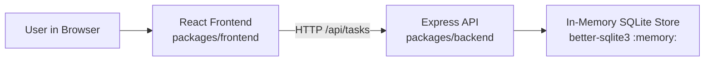
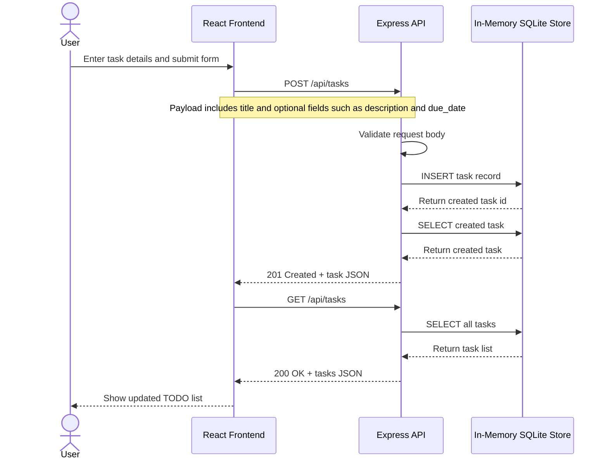

# Cloud Architecture Overview

This monorepo contains a simple three-part application architecture:

- A React frontend that runs in the browser
- An Express API that handles task operations
- An in-memory SQLite store used by the backend process

## System Context

## Create TODO Sequence

## Notes

- The frontend is the user-facing application and sends task requests to the backend API.
- The backend exposes task endpoints and contains the application business logic.
- Data is stored only in memory, so it resets whenever the backend process restarts.
- There is no external database, cloud storage, or third-party service dependency in the current implementation.
